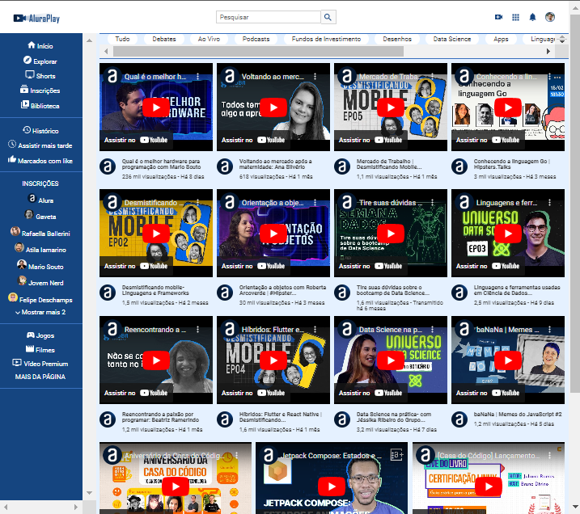

<h1 align="center">

   
  Projeto: Alura Play
</h1>

  <a href="#-tecnologias">Tecnologias</a>&nbsp;&nbsp;&nbsp;|&nbsp;&nbsp;&nbsp;
  <a href="#-projeto">Projeto</a>&nbsp;&nbsp;&nbsp;|&nbsp;&nbsp;&nbsp;

 

<h2>🖥️ Tela principal: </h2>

 

## ✨ Tecnologias

Esse projeto foi desenvolvido com as seguintes tecnologias:

- HTML
- CSS
- Videos com links incorporados do Youtube

 

## 💻 Projeto

Esse projeto consiste em uma aplicação para estudos na prática de funcionamento do Flexbox e layouts responsivos.

 
  
 

---
 
 

